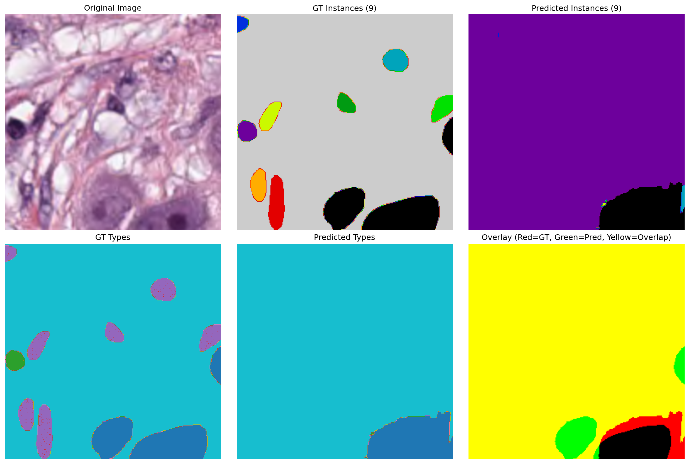

# Diagnostic Report: Low Recall Problem (7.69%)

**Date**: 2025-12-21
**Issue**: Model creates 1 giant fused instance instead of many small separated instances
**Metrics**: TP: 9, FP: 53, FN: 108 → Recall: 7.69%

---

## Summary

The ground truth evaluation shows terrible recall (7.69%) because **the model creates ONE GIANT INSTANCE covering the entire image** instead of 9 separate instances.



---

## Visual Evidence

### GT Instances (9 instances - CORRECT)
- Shows 9 separate colored blobs (blue, yellow, green, orange, red, purple, black)
- These are extracted using `connectedComponents` on the binary mask union (matching training)

### Predicted Instances (9 instances reported, but WRONG)
- Shows **ONE GIANT VIOLET instance** covering almost the entire image
- Some black/cyan fragments at the edges
- Watershed reports 9 instances, but they're not separated correctly

### Overlay (Red=GT, Green=Pred, Yellow=Overlap)
- **Mostly yellow** → The prediction covers the same area as GT
- This means **NP mask is probably correct** (detects tissue vs background)
- But **instance separation FAILED** (no boundaries between cells)

---

## Root Cause Analysis

### Hypothesis: Weak HV Gradient Predictions

The watershed post-processing algorithm works as follows:

```python
# Step 1: Compute HV gradients (should be HIGH at cell boundaries)
h_grad = np.abs(cv2.Sobel(hv_pred[0], cv2.CV_64F, 1, 0, ksize=3))
v_grad = np.abs(cv2.Sobel(hv_pred[1], cv2.CV_64F, 0, 1, ksize=3))
edge = h_grad + v_grad
edge = (edge - edge.min()) / (edge.max() - edge.min() + 1e-8)  # Normalize [0, 1]

# Step 2: Create markers by removing edges
markers = np_pred.copy()
markers[edge > 0.3] = 0  # ⚠️ CRITICAL: Remove pixels where edge is high
markers = (markers > 0.7).astype(np.uint8)

# Step 3: Label connected regions (seeds for watershed)
dist = ndimage.distance_transform_edt(binary_mask)
markers = ndimage.label(markers * (dist > 2))[0]

# Step 4: Watershed (separate instances)
instance_map = watershed(-dist, markers, mask=binary_mask)
```

**Problem**: If `edge.max()` is very low (weak HV gradients), then:
1. Normalization spreads weak gradients across [0, 1]
2. `edge > 0.3` removes almost nothing
3. `markers` remains a **giant connected blob**
4. `ndimage.label(markers)` creates **ONE GIANT SEED**
5. Watershed creates **ONE GIANT INSTANCE**

---

## Why Are HV Gradients Weak?

### Possible Causes

#### 1. **Training Data Mismatch** (MOST LIKELY)

The training pipeline uses `connectedComponents` on the binary mask union, which:
- **Fuses touching cells** into single instances
- Creates ground truth with **NO clear boundaries between touching nuclei**
- Model learns to predict **FUSED instances**, not separated ones

Example from `prepare_family_data.py` (lines 79-80):
```python
# NP: union de tous les types
np_mask = mask[:, :, 1:].sum(axis=-1) > 0
# ...
# HV: cartes horizontal/vertical
hv_targets[i] = compute_hv_maps(np_mask)  # ← Uses connectedComponents!
```

The `compute_hv_maps()` function (line 38):
```python
binary_uint8 = (binary_mask * 255).astype(np.uint8)
n_labels, labels = cv2.connectedComponents(binary_uint8)
```

**This creates HV targets for FUSED instances**, not PanNuke's true separated instances!

#### 2. **Insufficient Training Data for HV Branch**

From CLAUDE.md results:
| Family | Samples | HV MSE | Analysis |
|--------|---------|--------|----------|
| Glandular | 3535 | 0.0106 | ✅ Excellent |
| Digestive | 2274 | 0.0163 | ✅ Excellent |
| Urologic | 1153 | 0.2812 | ⚠️ Degraded |
| Epidermal | 574 | 0.2653 | ⚠️ Degraded |
| Respiratory | 364 | 0.0500 | ✅ Good |

The HV MSE is high (0.28) for families with <2000 samples, indicating **poor gradient prediction**.

#### 3. **Watershed Parameters Too Conservative**

Current parameters:
- `edge > 0.3`: Might be too high if gradients are weak
- `dist > 2`: Might be too large, requiring seeds to be far from edges
- `markers > 0.7`: Might be too high, reducing seed count

---

## Recommended Next Steps

### 1. **Visualize Raw HV Predictions** (Priority: HIGH)

Run `visualize_raw_predictions.py` to see:
- Raw NP mask (before threshold)
- Raw HV maps (horizontal/vertical)
- HV gradient magnitude
- Edge threshold effects

**Command** (requires Python environment):
```bash
python scripts/evaluation/visualize_raw_predictions.py \
    --npz_file data/evaluation/pannuke_fold2_converted/image_00002.npz \
    --checkpoint_dir models/checkpoints \
    --output_dir results/raw_preds
```

**Expected output**: `results/raw_preds/image_00002_raw_preds.png` showing:
- If `edge.max() < 0.5` → **HV gradients are weak** (confirms hypothesis)
- If `edge.max() > 2.0` → **Watershed parameters are wrong**

### 2. **Test Different Watershed Parameters** (Priority: MEDIUM)

Run parameter sweep to find optimal thresholds:
```bash
python scripts/evaluation/test_watershed_params.py \
    --npz_file data/evaluation/pannuke_fold2_converted/image_00002.npz \
    --checkpoint_dir models/checkpoints \
    --output_dir results/watershed_tests
```

This will test:
- `edge_threshold`: [0.1, 0.2, 0.3, 0.4]
- `dist_threshold`: [1, 2, 3, 4]

And highlight combinations that produce instance counts closest to GT (9 instances).

### 3. **Retrain HoVer-Net with True PanNuke Instances** (Priority: LOW, LONG-TERM)

The fundamental issue is that **training uses connectedComponents**, which fuses touching cells.

**Solution**: Modify `prepare_family_data.py` to use PanNuke's **true instance IDs** instead:

```python
# CURRENT (WRONG - fuses touching cells):
np_mask = mask[:, :, 1:].sum(axis=-1) > 0
hv_targets[i] = compute_hv_maps(np_mask)

# PROPOSED (CORRECT - respects PanNuke instances):
# Extract instance map from channels 1-4 (per-class instances)
inst_map = np.zeros((256, 256), dtype=np.int32)
instance_counter = 1
for c in range(1, 5):  # Channels 1-4
    class_instances = mask[:, :, c]
    inst_ids = np.unique(class_instances)
    inst_ids = inst_ids[inst_ids > 0]
    for inst_id in inst_ids:
        inst_mask = class_instances == inst_id
        inst_map[inst_mask] = instance_counter
        instance_counter += 1

# Channel 5 (Epithelial) is binary, use connectedComponents
epithelial_binary = mask[:, :, 5] > 0
_, epithelial_instances = cv2.connectedComponents(epithelial_binary.astype(np.uint8))
epithelial_instances[epithelial_instances > 0] += instance_counter - 1
inst_map[epithelial_instances > 0] = epithelial_instances[epithelial_instances > 0]

# Now compute HV maps from TRUE instance map
hv_targets[i] = compute_hv_maps_from_instances(inst_map)
```

**Impact**: This would require **full retraining** of all 5 HoVer-Net decoders (~10 hours).

---

## Decision Matrix

| Action | Effort | Impact | Risk | Priority |
|--------|--------|--------|------|----------|
| Visualize raw HV | 5 min | Diagnostic | None | ✅ HIGH |
| Test watershed params | 10 min | Quick fix if lucky | Low gain if HV weak | 🟡 MEDIUM |
| Retrain with true instances | 10 hours | Full fix | Might not converge | 🔴 LOW (last resort) |

---

## Questions for User

1. **Can you run the visualization script?** (requires Python environment)
   - If not, I can analyze the code statically

2. **What is the acceptable workflow?**
   - Option A: Accept fused instances (match training methodology)
   - Option B: Retrain to match PanNuke's true instances
   - Option C: Tune watershed parameters as workaround

3. **What is the evaluation goal?**
   - Clinical validation (does model match expert annotations?)
   - Technical validation (does model match what it was trained on?)

---

## Status

- ✅ Problem identified: 1 giant instance instead of many small ones
- ✅ Hypothesis: Weak HV gradients or bad watershed params
- ⚠️ Need to run `visualize_raw_predictions.py` to confirm
- ⚠️ Need user input on acceptable solution path
